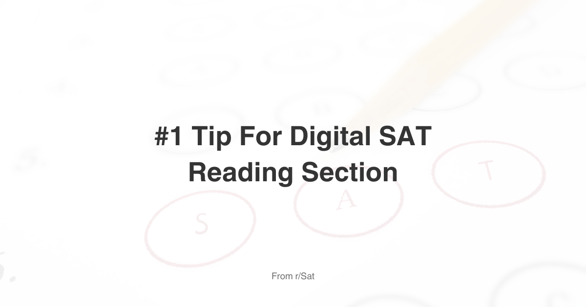

# #1 TIP FOR DIGITAL SAT READING SECTION (NO BS)

*Copied from Reddit (r/Sat). This helped me increase my score quite a lot, so I thought of sharing it here. Hope it helps!*

I know that 90% of you who score low on the reading section, specifically those who zone out when reading or have to read a passage multiple times, do so because of one single reason: You are in a hurry. You don't think you have enough time. On the practice tests, you'd run out of time, and now you think you have to answer the questions faster. But you would actually run out of time during practice questions because you were in a hurry (Ironic, right? Lol).

I realized this when watching Sol Lee take a full reading practice test. This guy takes the tests so casually; he literally talks in between questions, responding questions from the chat and giving advice, and he still manages to complete the test on time.

We've all had this exact scenario that literally ruins your score: You start the test strong, so far everything has been going well, you're confident in all of your answers. Now you read a text that you can't understand, and you spend THREE MINUTES on that single question. Finally, you answer the question—maybe correctly, maybe not.

Now, this is what I did, and I'm sure most of you do the same. After answering that question that you spent 3 minutes on, you move on to the next question and try to read the next text as fast as you can with the hope of catching up in time. Then what happens? Reading so quickly makes you not understand any of the text. Then you read it again (your heart rate rises, you start sweating, stress hormones dump in your brain), and you still don't understand anything. Now you've wasted another 3 minutes on the question. SIX MINUTES in total. You would have answered that question much quicker if you had slowed down instead of trying to catch up.

But you know what? You still have nothing to worry about. You have 70 seconds to answer each question, but some questions, like the grammar, transitions, and notes questions, take only a few seconds. So, an extra 6 minutes really mean nothing. You can still finish everything in time with 6 minutes wasted. Worst-case scenario—you don't have time to answer the last 1-3 questions. So what? Minus 40? Well, you still scored 760.

Now, what you have to do to not even waste those 6 minutes. Here's the trick—go slow, no matter what, don't panic. We all encounter that one question which, for some reason, is too difficult for us, and we waste 3 minutes on it. Well, after answering that question, take a deep breath, remind yourself to go slow, and move to the next question like you have all the time in the world. This way, you will not panic, and you will literally answer the next question in much shorter time than you would've if you tried to catch up in time.

But what if you encounter another difficult question that you have to spend another 3 minutes on? Now you're screwed, right? Now you have to really try to catch up in time with the next questions—NO!!!! 6 minutes mean nothing!!! You still have to calm yourself down after encountering those two insanely difficult questions. You have to go slow, realize that everything is actually going according to plan. You don't need to catch up! Again, worst-case scenario? You don't answer the last 2 questions (which is probably not going to happen, and you'll still manage to answer everything in time). And even that is a hundred times better than panicking and skimming over every single question for the entirety of the test.

This is what helped me drastically improve my score. Also, the key is to realize that you're not competing with the test. The SAT is a great test; it's on your side, it wants you to get a high score. It gives you plenty of time. Take the test casually, like you're playing a game or taking a test for fun.

Take a practice test now, go slow, read every single passage slowly and thoroughly understand what each sentence means. After you encounter a question you spend plenty of time on, tell yourself—this is perfectly normal, I will take a deep breath and I'll continue with the test like nothing happened. You can even rest for next 20 seconds, make a small talk with yourself, look out of the window, look at how other test takers struggle, lol. When you're calmed down, continue with the test.

Realizing this helped me raise my score from the 650s to 750+.

Good luck on the May SAT—please don't forget this single most important tip.

> Here's another tip: I'm not sure if this will work for everyone, but leaving the reading based questions (especially for module 2) to the end can actually help you to not panic. The other grammar question can be solved in 20-30 seconds, and if you use the rest of your time on those reading questions, you won't panic because of how long you've spent on a single question.
