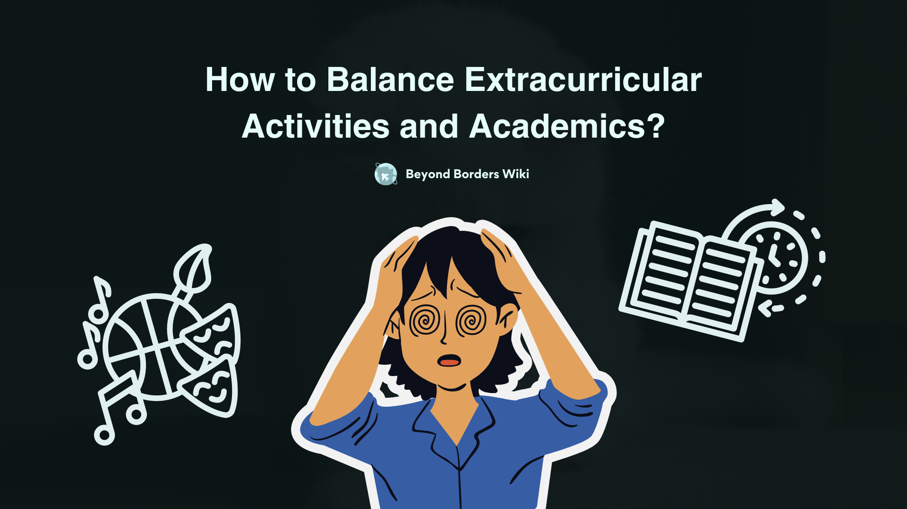

# How to balance Extracurricular activities and academics?

As students, we cannot overlook the importance of engaging in extracurricular activities (ECAs), along with academic studies. Participating in various extracurricular activities plays a crucial role in a student’s overall development, personal growth, mental well-being and essentially often helps to bag invaluable opportunities. Participating in extracurricular activities opens a door of endless opportunities, it allows us to acquire essential skills and knowledge out of academics–that usual classroom settings fail to provide.

Additionally, if you’re someone who is planning to apply to the USA-based colleges, juggling academics and ECAs might seem like a must-do; as they use a holistic evaluation approach while making admission decisions. Finding the right balance between academics and extracurricular activities can feel like juggling flaming torches while riding a unicycle. But don’t panic, as someone who belongs to the same club and was in the same shoes a while ago—I got you covered.

Throughout this piece, I am going to share some words about how I encountered this issue, especially for those planning to apply to USA colleges. With the right strategies, you can excel in both your academics and the places you’re passionate about.

**Prioritize and Plan:** We all know that it does not really matter whether it is about juggling academics and ECAs or other hustles, the key to balancing is effective planning and prioritization. Hence it is always better to start by getting to know your priorities, ask yourself, what you want.

Then start listing out all of your hustles to encounter (e.g. schoolwork, board test prep, if you’re planning to take APs, olympiad prep, internships, learn to code, clubs you’re affiliated with, founding a startup and summer camp, etc). After that, as I did, rank them in order of importance and rigor, it is okay if you do not care about rigor. But remember, your time is invaluable, hence please consider not falling for everything just because it is fun, know your priority. It is important to identify where you need to dedicate the most time and energy.

**Create a Schedule:** When you’re done with identifying your priorities now do consider creating a schedule, outlining specific time blocks for each activity. But don’t be unrealistic, we all have done this, creating a schedule that starts from praying for Fazr, doing meditations, walking for miles, taking cold showers and studying for 2400 hours a day…..anyway!

Be realistic about how much time you need for each task to get done, and don’t forget to include short downtime. You can consider utilizing schedule management or to-do planner tools like Sunsama, Notion, Todoist, etc. However, ensure that you have enough time for everything.

**Learn to Say No:** Yes, I know that exploring and trying out new things is cool and you should take advantage of the opportunities that come your way, however, as I said before “your time is invaluable, hence please consider not falling for everything just because it is fun, know your priority”. I mean it is equally important to know your limits.

So, If you feel overwhelmed with too many commitments, please don’t be afraid to say ‘no’. Remember, quality is more important than quantity. It is always a better trait to focus on a few quality ECA commitments that you are truly passionate about and excel in those, rather than just rushing like a Falcon.

**Time Management:** Throughout the journey, I can name one thing that must disappoint you a lot, Time Management. Time management is something that ensures whether you make the best use of your time. Hence it is important to consider keeping this in mind while juggling ECAs and academics. I used to struggle, and I do struggle the most with this, however, as I started following some time management techniques and methods, getting to witness a bit of improvement.

As I see it, there is not really any right time management technique—for some, the RPM method works, for some 8+8+8 rules and the list goes on. But I find the “Pomodoro” technique the most useful, you can consider applying this technique unless you are not already doing. There are a lot of Pomodoro timer tools and applications (e.g. Pomodor, Forest, Pomofocs) out there. Hope this method might work for you.

**Do not forget to look after your Mental health:** Throughout the journey, while maintaining a balance in academics and extracurriculars, you’re going to go through a lot. Amid this must-facing chaos, please do not forget to look after your mental health. It is equally (to some extent, more) important to prioritize mental well-being and self-care. Ensure that you’re getting enough sleep, eating healthy, having fun and exercising regularly.

When you feel overwhelmed you can go on a trip with loved ones, read books, watch your favorite TV series—or do something you wanted to do for a long time. Do whatever you need to feel content. Sometimes it is okay to prioritize mental health over anything. In addition, taking care of your mental health and body helps you stay motivated, focused, energized, and prepared to get ready to encounter any chaotic challenges that come your way.

These were my words from my experience. Hope this piece might help you navigate your way. Be proud of yourself, and how far you have come. Yes, you will indeed have to go through a lot, but over time you will realize how rewarding the way is! Don’t lose hope, as Stephen King’s words from The Shawshank Redemption go like this, “Remember, hope is a good thing, maybe the best of things and no good thing ever dies.”

> Zeehad AL Sheikh, *who’s actually an alien-feline, has been sent to Earth for a secret mission.*
> (zeehadalsheikh@gmail.com)